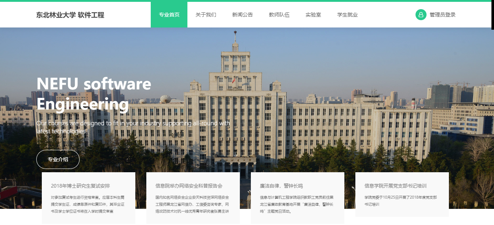
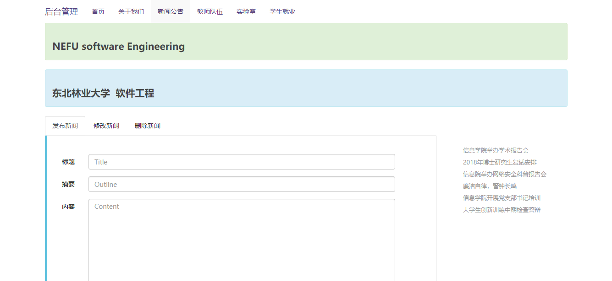
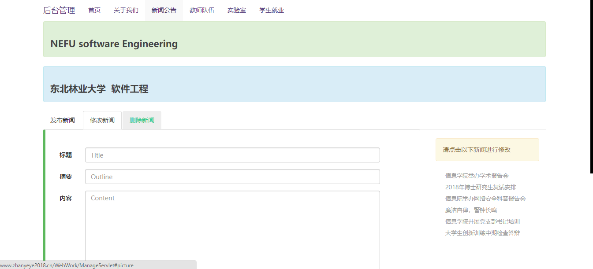
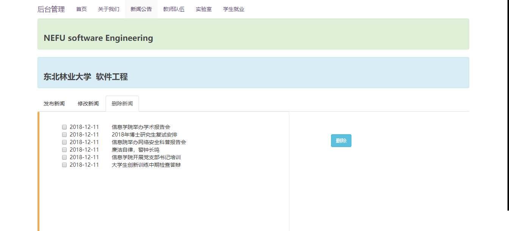
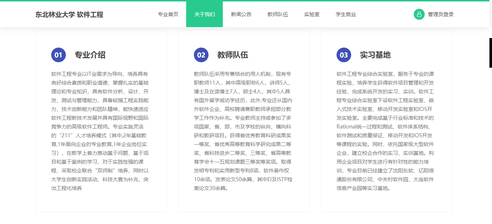
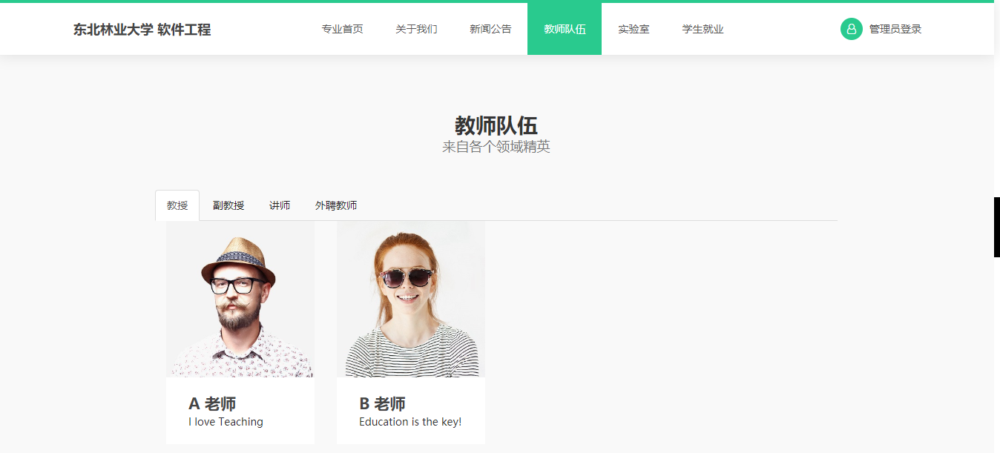
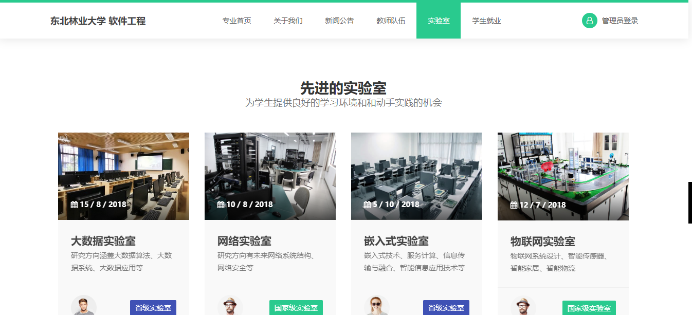
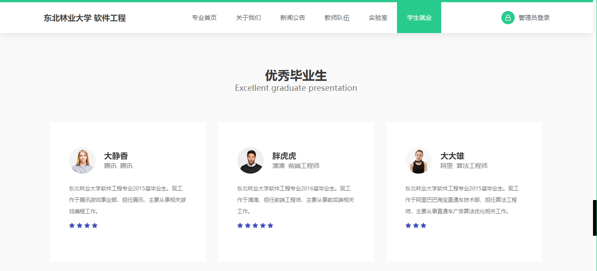

# nefu-Web
一个WEB课设
###### 功能
+ 主要板块内容：专业介绍，新闻，公告，实验室，教师队伍，优秀毕业生等
+ 管理员登录后，可在后台对新闻公告信息进行增删改查
+ 过滤器，非管理员无法使用管理功能
+ 主页列出最近 4 个新闻与公告，显示标题时间等，从数据库中获取，点击标题跳转至信息的详细描述

###### 预览
+ 首页

+ 后台增加

+ 后台修改

+ 后台删除

+ 关于

+ 教师

+ 实验室

+ 优秀毕业生

###### 最后
+ 能做出来多亏室友教我用 `bootstrap`，真的是越厉害的人越乐于助人!!!(^~^)
